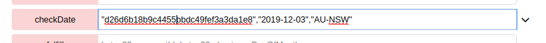
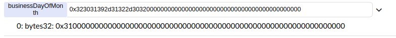
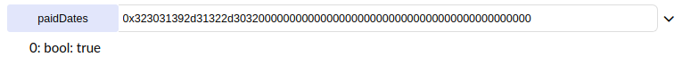

# Example Oracle Rental Contract (Chainlink)
This is an example Solidity contract that simulates a simple rental use case using Chainlink nodes to fulfil oracle requests.

## Use Case
A monthly rental amount of **0.01 ether** will be payable on the 1st working day of every month (1WDOM). The 1WDOM is something a smart contract
cannot  determine itself, so it needs to communitate with an oracle (via a Chainlink node) to get this information. The node uses the [Off Chain Data API](https://www.offchaindata.com) for date information.

**Note**
* The contract must be funded with ether to make rental payments.
* Rental payments are sent to a burner address.
* The contract must also be funded with LINK tokens to make payments to the oracle. Use this [faucet](https://ropsten.chain.link/) to obtain Ropsten test LINK tokens.
* You can change the monthly rental amount by calling setRentalAmount()

## Setup 
* `Clone this repository`
* `npm install`
* `truffle test`

## Deployment & Usage
* Run `truffle-flattener contracts/RentalContract.sol > RentalContract.dist.sol` and copy the contents of **RentalContract.dist.sol** to Remix.
* When deploying to Ropsten you can use then LINK and Oracle addresses listed in the comments of the contract's constructor.
* Below is an example of arguments to use in the call to checkDate(). The 1st argument is the Job Id which tells the node what data to return. You can use the Job Id listed in the comments of the checkDate() method.

Calling checkDate() will issue a request to the Oracle. Once the oracle returns data (which can take a few minutes), the fulfil() method will be called. If your requested date is a 1WDOM, the monthly rental amount will be deducted from the contract's balance.

* You can inspect what was returned by Oracle by looking at the businessDayOfMonth and paidDates member variables. 

You will need to convert your date string to the Bytes32 version using a tool such as [https://blockchangers.github.io/solidity-converter-online/](https://blockchangers.github.io/solidity-converter-online/)  

If you just want to play around with an already deployed contract, you can use the one found at this address **0x64d6a7d69d5121490a5f99daf6c17294b041675c**

